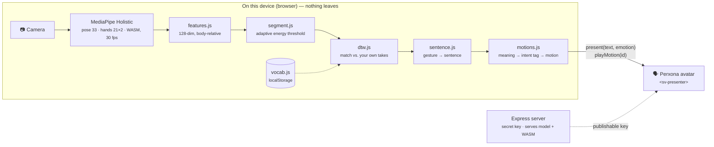

# Signer — your gestures, spoken by an avatar

> **Perxona Taipei Hackathon 2026.** A person who can hear but cannot speak teaches
> an avatar their own gestures. The avatar becomes their voice.

**▶ Try it live: <https://poyen-chen.github.io/Signer_Avatar/>** — no install, no sign-up.
The Perxona avatar starts by itself; press one of the sentences to hear it speak.
(The first load pulls down the 3D scene and can take up to a minute.)

[繁體中文](README.zh-TW.md)

## The idea

There are people who understand you perfectly and cannot answer you: after a
laryngectomy, with ALS, with cerebral palsy, with severe dysarthria. They *hear*.
They just have no voice.

Today their options are typing on a phone and pressing play. It is slow, and it
turns a conversation into an operation — the other person looks down at a screen
and listens to a machine, not at a person who is speaking to them.

Signer gives them a voice with a face:

1. **Teach.** Make any gesture you like — your own, not a sign language — and
   type the sentence it should say. Three takes. Thirty seconds.
2. **Speak.** From then on, that gesture makes a Perxona avatar say the sentence
   out loud, with a matching expression and body gesture: it raises a hand for a
   greeting, nods for a thank-you, and if it didn't catch the gesture it says
   *"Sorry, I didn't catch that. Let me try again."* — because for a mute user,
   the avatar asking to repeat **is** the user asking.

The other person sees a face that is talking to them. The mute person, for the
first time in that conversation, is someone who is *speaking* rather than
someone who is *typing*.

## Why an avatar, not a speaker

Take the avatar away and what is left is a keyboard and a loudspeaker — that has
existed for forty years. The avatar is what turns text-to-speech into a person:

- **A body that matches the meaning.** The Perxona motion catalog carries
  `intent:` tags (greeting, goodbye, apology, agreement, confusion…). Signer looks
  the spoken sentence up against them, so the body says what the mouth says.
- **A face the listener looks at.** People address faces. A listener talks *to*
  the avatar, and therefore to the person behind it — not to a phone screen.
- **In-character repair.** A recognition miss becomes the avatar politely asking
  again, which is what a person does, instead of a silent failure.

## Why personal gestures, not sign language

Sign language belongs to the Deaf community. Most hearing mute people do not sign
and should not have to learn a language to get a voice. Signer matches **the
user's own movements** against takes they recorded themselves, so:

- there is nothing to learn — any distinct movement works;
- it is private by construction — recognition runs entirely in the browser
  (MediaPipe Holistic + DTW template matching); no video and no landmark ever
  leaves the device. The only thing sent anywhere is the finished sentence,
  handed to the avatar to speak.

## Demo

**[▶ Watch the demo on YouTube](https://youtu.be/I5ZKS3Lbicg)** — teach a gesture, make it, and the avatar speaks.


- Launch an avatar, enable the camera.
- **Teach gestures** → type a sentence → *Record next take* → make the gesture →
  stop. Three times, varying speed and distance.
- **Speak** → make the gesture → the avatar says it.

To try it without recording first, **Import JSON** →
[`vocabulary/poyen.json`](samples/express/public/demos/signer/vocabulary/poyen.json)
— 23 gestures recorded by the author. They match the author well and others
poorly; record your own on top and yours take over.

The demo is at [`samples/express/public/demos/signer/`](samples/express/public/demos/signer/)
— see its [README](samples/express/public/demos/signer/README.md) for how it
works and what was measured, and the [run of show](https://claude.ai/code/artifact/46e55517-8f4f-4033-839a-cc7136ad0e0f)
for the five-minute stage script.

### Run it

```bash
cd samples/express
cp .env.example .env        # add your Perxona Connect secret + publishable keys
npm install
npm run fetch:signer-model  # 13 MB MediaPipe Holistic model, once
npm run dev                 # http://localhost:8083/demos/signer/
```

Needs Node ≥ 22, Chrome, a webcam, and a [Perxona Console](https://console.perxona.ai)
account (asia region) for the avatar. Recognition itself needs no account and no
network.

## How it works



The only thing that crosses the device boundary is the finished sentence, handed
to the avatar to speak. Video and landmarks stay in the browser; the model and
MediaPipe's WebAssembly are served from `localhost`, not a CDN.

| Stage | Tool | Why this one |
|---|---|---|
| Landmarks | MediaPipe Holistic | Open source, runs in the browser, no upload |
| Features | `features.js` | Handshape relative to the wrist, location relative to the shoulders — so distance from the camera and body size cancel out |
| Segmentation | `segment.js` | Thresholds are multiples of a measured noise floor (open at 2.0×, close at 1.65×), not absolute values, so they survive a change of camera or lighting |
| Recognition | DTW nearest-neighbour | **No training data.** It compares a gesture against the takes you recorded and absorbs the speed variation that breaks frame-by-frame comparison. Rejects on distance *and* on a thin margin over the runner-up — a wrong word gets spoken aloud on the user's behalf, so silence beats a guess |
| Gesture → motion | `motions.js` | Perxona's motion catalog carries `intent:` tags (greeting, apology, confusion…); the sentence is looked up against them so the body matches the words |
| Speech + face | Perxona Connect `<sv-presenter>` | `present()` for voice, lip-sync and expression; `playMotion()` for the body, independent of the speech queue so short sentences still get a full gesture |

Because recognition needs no dataset, teaching a new gesture is three takes and
about thirty seconds.

### Why the ASL tools could not be used

Three routes were tried; each stalled at a different point.

**1. The pre-trained ASL model — stalled at the browser runtime.**
[`sign/kaggle-asl-signs-1st-place`](https://huggingface.co/sign/kaggle-asl-signs-1st-place)
(250 signs, MIT, 11 MB, MediaPipe landmarks in) is the ideal model and it loads:
250 classes in 127 ms. The problem is running it. `@tensorflow/tfjs-tflite` is
the only way to run a `.tflite` in a browser, has been at `0.0.1-alpha.10` since
2023, and exposes no way to resize an input tensor — so the interpreter is stuck
at the placeholder `[1, 543, 3]`, and the graph aborts even there because it
wants a variable-length sequence. The fix is converting to ONNX for
`onnxruntime-web`; the wiring is kept in `asl.js`.

**2. Public ASL datasets as a seed vocabulary — stalled at cross-signer accuracy.**
[`scripts/build-seed-vocabulary.mjs`](samples/express/scripts/build-seed-vocabulary.mjs)
converts WLASL landmark sequences into this app's template format, through the
same `features.js` the live path uses. Measured on 16 signs × 5 takes from
different signers: same-sign distance 0.42, different-sign 0.65, and **~50%
precision when it speaks** at every rejection threshold. The signal is real
(seven times chance) but the limit is structural — DTW matches against
examples, and between-signer variation exceeds between-sign variation. Crossing
signers is what a trained model is for, which is route 1 again.

**3. A Korean model — stalled at missing documentation.**
`gyann/edge-sign-ksl-mediapipe` (2,771 signs) packs 137 OpenPose-convention
keypoints into 959 undocumented dimensions. Recovering the layout from its
published normalization stats produced scatter, not a skeleton. A wrong guess
there does not error; it returns a confident wrong word.

### Why that is not a problem for this product

All three routes fail on the same requirement: recognizing *everyone's* signs.
Signer does not need that. Its users hear but cannot speak; most do not sign and
should not have to learn a language to get a voice. Each person teaches their own
gestures and the system only ever has to recognize *that one person* — the exact
situation DTW is best at. Cross-signer accuracy of 42% is fatal for a sign
translation app and irrelevant here, because nobody performs anyone else's
gesture. That is not a coincidence: it is the direct result of positioning the
product as personal gestures rather than sign language.

## What is honest about it

- Recognition matches against the user's own recordings, so it is good for the
  person who recorded them and poor across people (measured: 42% cross-signer).
  For personal gestures that is the right trade — nobody needs to perform
  someone else's movement.
- Today's vocabulary is whatever the user has taught it. A pre-trained
  250-sign ASL model (Kaggle ISLR winner, MIT) is wired up in `asl.js` but
  parked: the only browser TFLite runtime cannot resize its input tensor.
  Converting it to ONNX is the next step.
- The avatar's automatic motion selection returns nothing on this account, so
  Signer picks body gestures itself from the catalog's intent tags. Only 6 of
  33 avatars carry those tags; the picker preselects one that does.

## Built on

The [Perxona Connect Kit](https://github.com/XRSPACE-Inc/perxona-connect-kit)
samples (Apache-2.0). Everything under `samples/express/` other than
`public/demos/signer/`, `scripts/fetch-signer-model.mjs`,
`scripts/build-seed-vocabulary.mjs` and small server/landing-page edits is
XRSPACE's original sample code — see their
[README](samples/express/README.md) for the Connect API, keys, and the
`<sv-presenter>` component.
