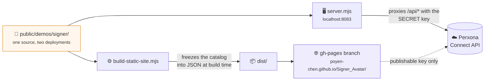
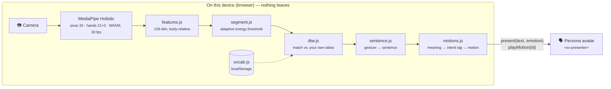

<h1 align="center">🤟 Signer</h1>

<p align="center">
  <strong>Your own gestures, spoken by a Perxona avatar.</strong><br>
  A voice for people who can hear but cannot speak.
</p>

<p align="center">
  <a href="https://poyen-chen.github.io/Signer_Avatar/"><strong>▶&nbsp; Try it live</strong></a>
  &nbsp;·&nbsp;
  <a href="https://youtu.be/I5ZKS3Lbicg">📺&nbsp; Watch the demo</a>
  &nbsp;·&nbsp;
  <a href="README.zh-TW.md">🇹🇼&nbsp; 繁體中文</a>
</p>

<p align="center">
  
  
  
</p>

---

## ⚡ In thirty seconds

|   | |
|---|---|
| 🧏 **Who** | People who hear but cannot speak — after a laryngectomy, with ALS, cerebral palsy, severe dysarthria |
| ✋ **Teach** | Make any gesture you like, type the sentence it should say. Three takes, thirty seconds |
| 🗣️ **Speak** | Make that gesture again — a Perxona avatar says the sentence aloud, with a matching face and body |
| 🔒 **Private** | Recognition runs entirely in your browser. No video, no landmark, ever leaves the device |
| 🎓 **No dataset** | Matched against your *own* recordings, so there is nothing to train and nothing to learn |

> **Open the live demo and press a sentence** — the avatar starts by itself, no
> camera and no sign-up needed. The first load pulls down the 3D scene and can
> take up to a minute.

---

## 🎯 The problem

There are people who understand you perfectly and cannot answer you. They *hear*.
They just have no voice.

Today their option is typing on a phone and pressing play. It is slow, and it
turns a conversation into an operation — the other person looks down at a screen
and listens to a machine, not at a person who is speaking to them.

Signer gives them a voice **with a face**. The listener sees someone talking to
them. The mute person, for the first time in that conversation, is someone who is
*speaking* rather than someone who is *typing*.

---

## 🤖 Why an avatar, not a loudspeaker

Take the avatar away and what is left is a keyboard and a speaker — that has
existed for forty years.

- **A body that matches the meaning.** Perxona's motion catalog carries `intent:`
  tags (greeting, goodbye, apology, agreement, confusion…). Signer looks the
  spoken sentence up against them, so the body says what the mouth says.
- **A face the listener looks at.** People address faces. A listener talks *to*
  the avatar, and therefore to the person behind it — not to a phone screen.
- **In-character repair.** A missed gesture becomes the avatar politely asking
  again — *"Sorry, I didn't catch that. Let me try again."* For a mute user, the
  avatar asking to repeat **is** the user asking.

## 🙌 Why personal gestures, not sign language

Sign language belongs to the Deaf community. Most hearing mute people do not sign
and should not have to learn a language to get a voice. Signer matches **the
user's own movements** against takes they recorded themselves — so there is
nothing to learn, any distinct movement works, and privacy is structural rather
than promised.

---

## 🚀 Try it

### Online — nothing to install

**<https://poyen-chen.github.io/Signer_Avatar/>**

The avatar launches on its own. Press one of the ten sentences to hear it speak,
then enable the camera if you want to teach it a gesture of your own.

### Locally — with the full Express sample

```bash
cd samples/express
cp .env.example .env        # add your Perxona Connect secret + publishable keys
npm install
npm run fetch:signer-model  # 13 MB MediaPipe Holistic model, once
npm run dev                 # → http://localhost:8083/demos/signer/
```

Needs Node ≥ 22, Chrome, a webcam, and a [Perxona Console](https://console.perxona.ai)
account (asia region) for the avatar. **Recognition itself needs no account and
no network.**

### Skip the recording

**Import JSON** →
[`vocabulary/poyen.json`](samples/express/public/demos/signer/vocabulary/poyen.json)
— 23 gestures recorded by the author. They match the author well and others
poorly; record your own on top and yours take over.

---

## 🗂️ Repository layout

```
Signer_Avatar/
├── 📄 README.md · README.zh-TW.md      the two you are reading
├── ⚖️ LICENSE-MIT                      Signer's own code
├── ⚖️ LICENSE                          Apache-2.0, XRSPACE's Connect Kit
├── 📊 Signer-專案說明.pdf · 投影片.pdf   hackathon submission + stage deck
│
└── samples/express/                    ← the app lives here
    ├── 🖥️  server.mjs                   dev server · holds the SECRET key
    ├── 📁 scripts/
    │   ├── build-static-site.mjs       ⭐ freezes the catalog → dist/ → gh-pages
    │   ├── fetch-signer-model.mjs      downloads the 13 MB MediaPipe model
    │   └── build-seed-vocabulary.mjs   WLASL → template format (parked, see below)
    └── 📁 public/demos/signer/         ⭐ THE DEMO — zero build step, plain ESM
        ├── index.html · style.css      two modes: Speak · Teach gestures
        ├── app.js                      orchestrator · camera loop · avatar calls
        │
        ├── ─── recognition (on-device) ───
        ├── features.js                 landmarks → 128-dim body-relative vector
        ├── segment.js                  adaptive motion-energy segmentation
        ├── dtw.js                      dynamic time warping vs. your own takes
        ├── vocab.js                    your recordings, in localStorage
        │
        ├── ─── meaning → avatar ───
        ├── sentence.js                 gestures → English sentence + emotion
        ├── motions.js                  meaning → intent: tag → motion id
        │
        ├── asl.js                      pre-trained ASL model, wired but parked
        └── vocabulary/poyen.json       23 gestures, importable
```

Everything else under `samples/express/` (and all of `tools/`) is XRSPACE's
original Connect Kit sample code, untouched.

### Two ways the same code runs



`index.html` declares `SIGNER_STATIC` on the published build; without it, the
identical `app.js` talks to the Express server instead. The secret key never
leaves the developer's machine.

---

## ⚙️ How it works



**The only thing that crosses the device boundary is the finished sentence.**
Video and landmarks stay in the browser.

<details>
<summary><strong>📐 Why each piece was chosen</strong></summary>

<br>

| Stage | Tool | Why this one |
|---|---|---|
| Landmarks | MediaPipe Holistic | Open source, runs in the browser, no upload |
| Features | `features.js` | Handshape relative to the wrist, location relative to the shoulders — so distance from the camera and body size cancel out |
| Segmentation | `segment.js` | Thresholds are multiples of a measured noise floor (open at 2.0×, close at 1.65×), not absolute values, so they survive a change of camera or lighting |
| Recognition | DTW nearest-neighbour | **No training data.** Compares a gesture against the takes you recorded and absorbs the speed variation that breaks frame-by-frame comparison. Rejects on distance *and* on a thin margin over the runner-up — a wrong word gets spoken aloud on the user's behalf, so silence beats a guess |
| Gesture → motion | `motions.js` | Perxona's catalog carries `intent:` tags; the sentence is looked up against them so the body matches the words |
| Speech + face | Perxona Connect `<sv-presenter>` | `present()` for voice, lip-sync and expression; `playMotion()` for the body, independent of the speech queue so short sentences still get a full gesture |

Because recognition needs no dataset, teaching a new gesture is three takes and
about thirty seconds.

</details>

<details>
<summary><strong>🧪 Why the pre-trained ASL tools could not be used</strong> — three routes, three different walls</summary>

<br>

**1️⃣ The pre-trained ASL model — stalled at the browser runtime.**
[`sign/kaggle-asl-signs-1st-place`](https://huggingface.co/sign/kaggle-asl-signs-1st-place)
(250 signs, MIT, 11 MB, MediaPipe landmarks in) is the ideal model and it loads:
250 classes in 127 ms. The problem is running it. `@tensorflow/tfjs-tflite` is
the only way to run a `.tflite` in a browser, has been at `0.0.1-alpha.10` since
2023, and exposes no way to resize an input tensor — so the interpreter is stuck
at the placeholder `[1, 543, 3]`, and the graph aborts even there because it
wants a variable-length sequence. The fix is converting to ONNX for
`onnxruntime-web`; the wiring is kept in `asl.js`.

**2️⃣ Public ASL datasets as a seed vocabulary — stalled at cross-signer accuracy.**
[`scripts/build-seed-vocabulary.mjs`](samples/express/scripts/build-seed-vocabulary.mjs)
converts WLASL landmark sequences into this app's template format, through the
same `features.js` the live path uses. Measured on 16 signs × 5 takes from
different signers: same-sign distance 0.42, different-sign 0.65, and **~50%
precision when it speaks** at every rejection threshold. The signal is real
(seven times chance) but the limit is structural — DTW matches against examples,
and between-signer variation exceeds between-sign variation.

**3️⃣ A Korean model — stalled at missing documentation.**
`gyann/edge-sign-ksl-mediapipe` (2,771 signs) packs 137 OpenPose-convention
keypoints into 959 undocumented dimensions. Recovering the layout from its
published normalization stats produced scatter, not a skeleton. A wrong guess
there does not error; it returns a confident wrong word.

### Why that is not a problem for this product

All three fail on the same requirement: recognizing *everyone's* signs. Signer
does not need that. Each person teaches their own gestures and the system only
ever has to recognize *that one person* — the exact situation DTW is best at.
Cross-signer accuracy of 42% is fatal for a sign-translation app and irrelevant
here, because nobody performs anyone else's gesture. That is not a coincidence:
it is the direct result of positioning the product as personal gestures rather
than sign language.

</details>

---

## 🔍 What is honest about it

- **Recognition is personal, not universal.** It is good for the person who
  recorded the takes and poor across people (measured: 42% cross-signer). For
  personal gestures that is the right trade.
- **The vocabulary is whatever you taught it.** A pre-trained 250-sign ASL model
  is wired up in `asl.js` but parked — see the section above. ONNX is the next step.
- **The avatar's automatic motion selection returns nothing** on this account, so
  Signer picks body gestures itself from the catalog's `intent:` tags. Only 6 of
  33 avatars carry those tags; the picker preselects one that does.
- **First load is slow.** The 3D scene is 20–60 seconds on a cold cache.

---

## ⚖️ License

| License | Applies to |
|---|---|
| 🟢 **MIT** — [`LICENSE-MIT`](LICENSE-MIT) | Signer's own code: `public/demos/signer/`, `scripts/build-static-site.mjs`, `scripts/fetch-signer-model.mjs`, `scripts/build-seed-vocabulary.mjs`, both READMEs © 2026 Po-Yen Chen |
| 🟠 **Apache-2.0** — [`LICENSE`](LICENSE) | Everything else: the [Perxona Connect Kit](https://github.com/XRSPACE-Inc/perxona-connect-kit) samples and tools © XRSPACE CO., LTD. |

This repository is a fork, so the upstream sample code keeps the license it
arrived under. See XRSPACE's [sample README](samples/express/README.md) for the
Connect API, key handling, and the `<sv-presenter>` component.
