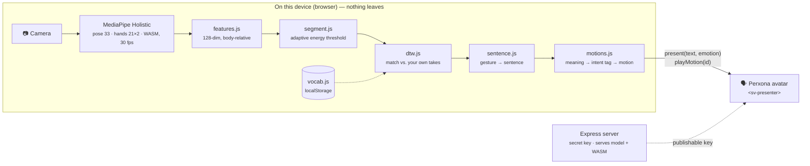

# Signer — 用你自己的手勢，讓 avatar 替你開口

> **Perxona Taipei Hackathon 2026。** 一個聽得到、卻說不出話的人，教 avatar 認得自己的手勢。
> 從此 avatar 就是他的聲音。

[English](README.md)

## 想法

有一群人完全聽得懂你，卻沒辦法回答你：喉癌切除聲帶的人、漸凍人、腦性麻痺、
嚴重構音障礙。他們**聽得到**，只是沒有聲音。

現在他們的選擇是在手機上打字、按播放。很慢，而且把一段對話變成一次操作 ——
對方低頭盯著螢幕、聽一個機器的聲音，而不是看著一個正在對他說話的人。

Signer 給他們一個**有臉的聲音**：

1. **教。** 隨便做一個手勢 —— 你自己的，不是手語 —— 打上它該說的那句話。錄三次，三十秒。
2. **說。** 之後只要做那個手勢，Perxona avatar 就會把那句話大聲說出來，
   配上對應的表情和動作：打招呼會舉手、道謝會點頭；沒看清楚手勢時會說
   *「不好意思，我沒聽清楚，再一次。」*—— 因為對一個說不出話的人來說，
   **avatar 開口請對方再一次，就是他自己在請對方再一次。**

對方看到的是一張正在跟他說話的臉。而那個說不出話的人，在這段對話裡第一次
是一個**在說話**的人，而不是一個**在打字**的人。

## 為什麼是 avatar，不是喇叭

把 avatar 拿掉，剩下的是一個鍵盤加一個喇叭 —— 那東西已經存在四十年了。
avatar 是把文字轉語音變成一個「人」的關鍵：

- **身體跟語意一致。** Perxona 的動作庫帶有 `intent:` 標籤（greeting、goodbye、
  apology、agreement、confusion……）。Signer 拿要說的句子去查，讓身體說的跟嘴巴說的是同一件事。
- **一張讓對方看著的臉。** 人會對著臉說話。對方跟 avatar 講話，就是在跟它背後那個人講話 ——
  而不是對著一支手機。
- **不出戲的補救。** 辨識失敗變成 avatar 有禮貌地再問一次，這是人會做的事，
  而不是一個沉默的錯誤。

## 為什麼是自己的手勢，不是手語

手語是聾人社群的語言。多數聽得到的無法說話者並不會手語，也不該為了有一個聲音而去學一門語言。
Signer 比對的是**使用者自己的動作**，對照他自己錄的樣本，所以：

- 不用學任何東西 —— 任何分得出來的動作都行；
- 隱私是結構上保證的 —— 辨識完全在瀏覽器裡跑（MediaPipe Holistic + DTW 樣板比對），
  影像和骨架都不會離開裝置。唯一送出去的是那句已經翻好的話，交給 avatar 唸。

## Demo

**[▶ 在 YouTube 看 demo 影片](https://youtu.be/I5ZKS3Lbicg)** —— 教一個手勢、比出來、avatar 就講。


- 啟動 avatar，開啟攝影機。
- **Teach gestures** → 打一句話 → *Record next take* → 做手勢 → 停下。三次，換點速度和距離。
- **Speak** → 做手勢 → avatar 說出那句話。

想先不錄就試，**Import JSON** →
[`vocabulary/poyen.json`](samples/express/public/demos/signer/vocabulary/poyen.json)
—— 作者錄的 23 個手勢。對作者本人很準、對別人不準；在上面錄你自己的，就會以你的為主。

程式在 [`samples/express/public/demos/signer/`](samples/express/public/demos/signer/)，
運作原理與實測數據見它的 [README](samples/express/public/demos/signer/README.md)；
五分鐘的上台腳本見 [run of show](https://claude.ai/code/artifact/46e55517-8f4f-4033-839a-cc7136ad0e0f)。

### 執行

```bash
cd samples/express
cp .env.example .env        # 填入 Perxona Connect 的 secret 與 publishable key
npm install
npm run fetch:signer-model  # 13 MB 的 MediaPipe Holistic 模型，只需一次
npm run dev                 # http://localhost:8083/demos/signer/
```

需要 Node ≥ 22、Chrome、攝影機，以及一個 [Perxona Console](https://console.perxona.ai)
帳號（asia 區）供 avatar 使用。辨識本身不需要帳號、不需要網路。

## 運作方式



唯一離開裝置的東西是那句已經翻好的話，交給 avatar 唸。影像和骨架都留在瀏覽器；
模型和 MediaPipe 的 WebAssembly 從 `localhost` 提供，不走 CDN。

| 階段 | 工具 | 為什麼選它 |
|---|---|---|
| 骨架 | MediaPipe Holistic | 開源、跑在瀏覽器、不用上傳影像 |
| 特徵 | `features.js` | 手形相對手腕、位置相對肩膀 —— 離鏡頭多遠、身材多大都抵消掉 |
| 分段 | `segment.js` | 門檻是量測到的噪訊底線的倍數（2.0× 開始、1.65× 結束），不是絕對值，換攝影機或燈光都還能用 |
| 辨識 | DTW 最近鄰 | **不需要訓練資料。**拿手勢跟你錄的樣本比對，能吸收逐格比對會失效的速度差異。距離太遠拒識、跟次選太接近也拒識 —— 錯字會用使用者的名義大聲講出來，寧可沉默也不猜 |
| 手勢 → 動作 | `motions.js` | Perxona 動作庫帶 `intent:` 標籤（greeting、apology、confusion…），拿句子去查，讓身體跟嘴巴說的一致 |
| 語音 + 表情 | Perxona Connect `<sv-presenter>` | `present()` 負責聲音、口型、表情；`playMotion()` 負責身體，獨立於語音佇列，短句也放得完整個動作 |

因為辨識不需要資料集，教一個新手勢就是錄三次、大約三十秒。

### 為什麼美國手語（ASL）的工具用不上

試了三條路，各卡在不同的地方。

**1. 預訓練 ASL 模型 —— 卡在瀏覽器 runtime。**
[`sign/kaggle-asl-signs-1st-place`](https://huggingface.co/sign/kaggle-asl-signs-1st-place)
（250 個詞、MIT、11 MB、吃 MediaPipe 骨架）是最理想的模型，也真的載入成功：250 類、127 ms。
問題在跑它的東西。瀏覽器唯一能跑 `.tflite` 的 `@tensorflow/tfjs-tflite` 從 2023 年起停在
`0.0.1-alpha.10`，沒有調整輸入張量大小的 API —— 直譯器被鎖在佔位的 `[1, 543, 3]`，
而模型需要可變長度序列，連這個形狀都直接中止。解法是轉成 ONNX 給 `onnxruntime-web` 跑；
接線留在 `asl.js`。

**2. 公開 ASL 資料集當種子詞彙 —— 卡在跨人準確率。**
[`scripts/build-seed-vocabulary.mjs`](samples/express/scripts/build-seed-vocabulary.mjs)
把 WLASL 的骨架序列轉成這個 app 的樣板格式，走的是跟即時路徑同一份 `features.js`。
用 16 個詞 × 5 個不同人的樣本量測：同詞距離 0.42、異詞 0.65，
**開口時精確度約 50%**，調任何拒識門檻都一樣。訊號是真的（7 倍於隨機），但限制是結構性的 ——
DTW 比對的是範例，而人跟人的差異大於詞跟詞的差異。跨人是訓練模型要解的事，又回到第 1 條。

**3. 韓國手語模型 —— 卡在沒有文件。**
`gyann/edge-sign-ksl-mediapipe`（2,771 個詞）把 137 個 OpenPose 慣例的關鍵點塞進 959 維，
排列方式沒有任何說明。從它公開的正規化統計反推，畫出來是散點不是人形。
猜錯不會報錯，只會回一個信心很高的錯詞。

### 為什麼這對這個產品剛好不是問題

三條路卡在同一個要求：認得**所有人**的手語。Signer 不需要這個。它的使用者聽得到但說不出來，
多半不會手語，也不該為了有聲音去學一門語言。每個人教自己的手勢，系統只需要認得**那一個人** ——
正是 DTW 最擅長的情境。跨人 42% 對手語翻譯 app 是致命傷，在這裡無關緊要，
因為沒有人需要比別人的動作。這不是巧合，是把產品定位從「手語」改成「個人手勢」的直接結果。

## 誠實的部分

- 辨識比對的是使用者自己的錄影，所以對錄的那個人很準、換人就差（實測跨人 42%）。
  對個人手勢來說這是對的取捨 —— 沒有人需要做別人的動作。
- 現在認得的詞彙就是使用者教過的。一個預訓練的 250 詞 ASL 模型（Kaggle ISLR 冠軍，MIT）
  已經接在 `asl.js`，但停在那裡：瀏覽器唯一的 TFLite runtime 無法調整輸入張量大小。
  下一步是轉成 ONNX。
- 這個帳號上 avatar 的自動動作選擇不會回傳任何東西，所以 Signer 自己從動作庫的
  intent 標籤挑身體動作。33 隻 avatar 裡只有 6 隻帶這些標籤；選單預設選有標籤的那隻。

## 基於

[Perxona Connect Kit](https://github.com/XRSPACE-Inc/perxona-connect-kit) 的範例（Apache-2.0）。
`samples/express/` 底下除了 `public/demos/signer/`、`scripts/fetch-signer-model.mjs`、
`scripts/build-seed-vocabulary.mjs` 和少量伺服器／首頁修改之外，都是 XRSPACE 的原始範例程式 ——
Connect API、金鑰與 `<sv-presenter>` 元件請見他們的 [README](samples/express/README.md)。
