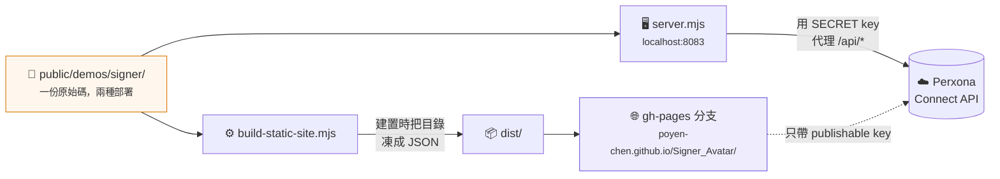
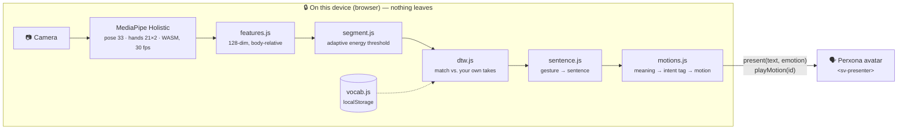

<h1 align="center">🤟 Signer</h1>

<p align="center">
  <strong>用你自己的手勢，讓 Perxona avatar 替你開口。</strong><br>
  給聽得到、卻說不出話的人一個聲音。
</p>

<p align="center">
  <a href="https://poyen-chen.github.io/Signer_Avatar/"><strong>▶&nbsp; 線上直接玩</strong></a>
  &nbsp;·&nbsp;
  <a href="https://youtu.be/I5ZKS3Lbicg">📺&nbsp; 看 demo 影片</a>
  &nbsp;·&nbsp;
  <a href="README.md">🇬🇧&nbsp; English</a>
</p>

<p align="center">
  
  
  
</p>

---

## ⚡ 三十秒看懂

|   | |
|---|---|
| 🧏 **誰用** | 聽得到、卻說不出話的人 —— 喉癌切除聲帶、漸凍人、腦性麻痺、嚴重構音障礙 |
| ✋ **教** | 隨便做一個手勢，打上它該說的那句話。錄三次，三十秒 |
| 🗣️ **說** | 再做一次那個手勢 —— Perxona avatar 就把那句話說出來，配上對應的表情與身體動作 |
| 🔒 **隱私** | 辨識完全在瀏覽器裡跑。影像和骨架都不離開這台裝置 |
| 🎓 **免資料集** | 比對的是你**自己**錄的樣本，所以沒有東西要訓練，也沒有東西要學 |

> **打開線上版、點一句話就好** —— avatar 會自己啟動，不用開相機、不用註冊。
> 首次載入要下載 3D 場景，可能需要一分鐘。

---

## 🎯 問題

有一群人完全聽得懂你，卻沒辦法回答你。他們**聽得到**，只是沒有聲音。

現在他們的選擇是在手機上打字、按播放。很慢，而且把一段對話變成一次操作 ——
對方低頭盯著螢幕、聽一個機器的聲音，而不是看著一個正在對他說話的人。

Signer 給他們一個**有臉的聲音**。對方看到的是一張正在跟他說話的臉；而那個說不出話
的人，在這段對話裡第一次是一個**在說話**的人，而不是一個**在打字**的人。

---

## 🤖 為什麼是 avatar，不是喇叭

把 avatar 拿掉，剩下的是一個鍵盤加一個喇叭 —— 那東西已經存在四十年了。

- **身體跟語意一致。** Perxona 的動作庫帶有 `intent:` 標籤（greeting、goodbye、
  apology、agreement、confusion……）。Signer 拿要說的句子去查，讓身體說的跟嘴巴說的
  是同一件事。
- **一張讓對方看著的臉。** 人會對著臉說話。對方跟 avatar 講話，就是在跟它背後那個人
  講話 —— 而不是對著一支手機。
- **不出戲的補救。** 辨識失敗變成 avatar 有禮貌地再問一次 ——
  *「不好意思，我沒聽清楚，再一次。」* 對一個說不出話的人來說，
  **avatar 開口請對方再一次，就是他自己在請對方再一次。**

## 🙌 為什麼是自己的手勢，不是手語

手語是聾人社群的語言。多數聽得到的無法說話者並不會手語，也不該為了有一個聲音而去
學一門語言。Signer 比對的是**使用者自己的動作**，對照他自己錄的樣本 —— 所以不用學
任何東西、任何分得出來的動作都行，而隱私是結構上保證的，不是嘴上保證的。

---

## 🚀 開始用

### 線上版 —— 什麼都不用裝

**<https://poyen-chen.github.io/Signer_Avatar/>**

avatar 會自己啟動。點十句範例其中一句就聽得到它開口；想教它你自己的手勢，再開相機。

### 本機版 —— 含完整 Express 範例

```bash
cd samples/express
cp .env.example .env        # 填入 Perxona Connect 的 secret 與 publishable key
npm install
npm run fetch:signer-model  # 13 MB 的 MediaPipe Holistic 模型，只需一次
npm run dev                 # → http://localhost:8083/demos/signer/
```

需要 Node ≥ 22、Chrome、攝影機，以及一個 [Perxona Console](https://console.perxona.ai)
帳號（asia 區）供 avatar 使用。**辨識本身不需要帳號、不需要網路。**

### 不想先錄？

**Import JSON** →
[`vocabulary/poyen.json`](samples/express/public/demos/signer/vocabulary/poyen.json)
—— 作者錄的 23 個手勢。對作者本人很準、對別人不準；在上面錄你自己的，就會以你的為主。

---

## 🗂️ Repo 架構

```
Signer_Avatar/
├── 📄 README.md · README.zh-TW.md      你正在看的這兩份
├── ⚖️ LICENSE-MIT                      Signer 自己的程式碼
├── ⚖️ LICENSE                          Apache-2.0，XRSPACE 的 Connect Kit
├── 📊 Signer-專案說明.pdf · 投影片.pdf   黑客松書面稿與上台簡報
│
└── samples/express/                    ← 應用程式在這裡
    ├── 🖥️  server.mjs                   開發伺服器 · 持有 SECRET key
    ├── 📁 scripts/
    │   ├── build-static-site.mjs       ⭐ 把目錄凍成 JSON → dist/ → gh-pages
    │   ├── fetch-signer-model.mjs      下載 13 MB 的 MediaPipe 模型
    │   └── build-seed-vocabulary.mjs   WLASL → 樣板格式（已擱置，見下）
    └── 📁 public/demos/signer/         ⭐ 本體 —— 零建置步驟、純 ESM
        ├── index.html · style.css      兩個模式：Speak · Teach gestures
        ├── app.js                      主控 · 相機迴圈 · 呼叫 avatar
        │
        ├── ─── 辨識（裝置端） ───
        ├── features.js                 骨架 → 128 維、以身體為基準的向量
        ├── segment.js                  以動能自適應切分手勢起訖
        ├── dtw.js                      動態時間規整，比對你自己的樣本
        ├── vocab.js                    你的錄音，存在 localStorage
        │
        ├── ─── 語意 → avatar ───
        ├── sentence.js                 手勢 → 英文句子 + 情緒
        ├── motions.js                  語意 → intent: 標籤 → 動作 id
        │
        ├── asl.js                      預訓練 ASL 模型，接好但擱置
        └── vocabulary/poyen.json       23 個手勢，可匯入
```

`samples/express/` 底下其餘檔案（以及整個 `tools/`）都是 XRSPACE 原本的 Connect Kit
範例程式，沒有更動。

### 同一份程式碼的兩種跑法



線上版的 `index.html` 會宣告 `SIGNER_STATIC`；沒有它時，同一支 `app.js` 就改去跟
Express 伺服器講話。secret key 從頭到尾不離開開發者的機器。

---

## ⚙️ 運作方式



**唯一跨出裝置邊界的，只有那句已經組好的話。** 影像和骨架都留在瀏覽器裡。

<details>
<summary><strong>📐 每個環節為什麼選它</strong></summary>

<br>

| 環節 | 工具 | 為什麼是它 |
|---|---|---|
| 骨架 | MediaPipe Holistic | 開源、在瀏覽器裡跑、不上傳 |
| 特徵 | `features.js` | 手形以手腕為基準、位置以肩膀為基準 —— 離鏡頭多遠、身材多大都會被抵消 |
| 切分 | `segment.js` | 門檻是「量到的噪音底線」的倍數（開 2.0×、關 1.65×），不是絕對值，所以換相機或換光線都還活著 |
| 辨識 | DTW 最近鄰 | **不需要訓練資料。** 拿手勢去比對你錄的樣本，並吸收掉逐幀比對撐不住的速度差異。距離**和**與第二名的差距兩者都要過 —— 說錯的話是用使用者的名義說出去的，所以沉默勝過猜測 |
| 手勢 → 動作 | `motions.js` | Perxona 動作庫帶 `intent:` 標籤，拿句子去查，身體才會跟嘴巴說同一件事 |
| 語音 + 表情 | Perxona Connect `<sv-presenter>` | `present()` 負責聲音、口型與表情；`playMotion()` 負責身體，且獨立於語音佇列，所以短句也做得完整個動作 |

因為辨識不需要資料集，教一個新手勢就是錄三次、大約三十秒。

</details>

<details>
<summary><strong>🧪 為什麼那些預訓練 ASL 工具都用不了</strong> —— 三條路，三面不同的牆</summary>

<br>

**1️⃣ 預訓練 ASL 模型 —— 卡在瀏覽器 runtime。**
[`sign/kaggle-asl-signs-1st-place`](https://huggingface.co/sign/kaggle-asl-signs-1st-place)
（250 個手語詞、MIT、11 MB、吃 MediaPipe 骨架）本來是最理想的模型，而且載得起來：
250 類、127 ms。問題是跑不動。`@tensorflow/tfjs-tflite` 是瀏覽器裡跑 `.tflite` 的唯一
途徑，自 2023 年起停在 `0.0.1-alpha.10`，而且沒有任何 API 可以 resize 輸入張量 ——
interpreter 因此卡在佔位的 `[1, 543, 3]`，就算卡在那裡計算圖也會中止，因為它要的是
變動長度的序列。解法是轉成 ONNX 給 `onnxruntime-web`；接線保留在 `asl.js`。

**2️⃣ 用公開 ASL 資料集當種子詞庫 —— 卡在跨簽名者準確度。**
[`scripts/build-seed-vocabulary.mjs`](samples/express/scripts/build-seed-vocabulary.mjs)
把 WLASL 的骨架序列轉成本專案的樣板格式，走的是跟線上路徑同一支 `features.js`。
在 16 個詞 × 5 次、來自不同簽名者的資料上實測：同詞距離 0.42、異詞 0.65，而且
**只要它開口，精確率大約 50%** —— 每一個拒絕門檻都一樣。訊號是真的（七倍於隨機），
但限制是結構性的：DTW 比的是範例，而人與人之間的差異大過詞與詞之間的差異。

**3️⃣ 一個韓文模型 —— 卡在文件不存在。**
`gyann/edge-sign-ksl-mediapipe`（2,771 個詞）把 137 個 OpenPose 慣例的關鍵點塞進
959 個沒有文件的維度。從它公布的正規化統計量去反推排列，得到的是散點，不是骨架。
猜錯不會報錯，它會回一個很有自信的錯字。

### 為什麼這對這個產品不構成問題

三條路都倒在同一個要求上：辨識**所有人**的手語。Signer 不需要那個。每個人教的是自己
的手勢，系統永遠只要認得**那一個人** —— 這正是 DTW 最擅長的處境。42% 的跨簽名者準確度
對一個手語翻譯 app 是致命的，在這裡卻無關緊要，因為沒有人會去做別人的手勢。這不是巧合：
它是「把產品定位成個人手勢而不是手語」直接換來的結果。

</details>

---

## 🔍 誠實說明

- **辨識是個人化的，不是通用的。** 對錄樣本的那個人準，對別人不準（實測跨人 42%）。
  以個人手勢來說，這個取捨是對的。
- **詞庫就是你教過的那些。** 一個 250 詞的預訓練 ASL 模型已經接在 `asl.js` 裡但擱置中 ——
  原因見上一節。下一步是轉 ONNX。
- **avatar 的自動選動作在這個帳號上完全沒有作用**，所以 Signer 自己從動作庫的
  `intent:` 標籤挑。33 個 avatar 裡只有 6 個帶這些標籤，選單會預選一個有的。
- **首次載入很慢。** 冷快取下 3D 場景要 20–60 秒。

---

## ⚖️ 授權

| 授權 | 適用範圍 |
|---|---|
| 🟢 **MIT** —— [`LICENSE-MIT`](LICENSE-MIT) | Signer 自己的程式碼：`public/demos/signer/`、`scripts/build-static-site.mjs`、`scripts/fetch-signer-model.mjs`、`scripts/build-seed-vocabulary.mjs`，以及兩份 README。© 2026 Po-Yen Chen |
| 🟠 **Apache-2.0** —— [`LICENSE`](LICENSE) | 其餘全部：[Perxona Connect Kit](https://github.com/XRSPACE-Inc/perxona-connect-kit) 的範例與工具 © XRSPACE CO., LTD. |

這個 repo 是 fork，所以上游的範例程式維持它原本的授權。Connect API、金鑰處理與
`<sv-presenter>` 元件請見 XRSPACE 的[範例 README](samples/express/README.md)。
